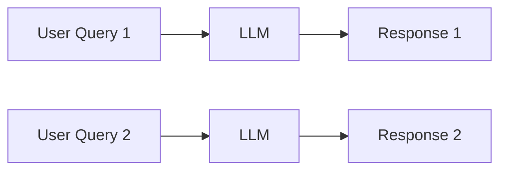
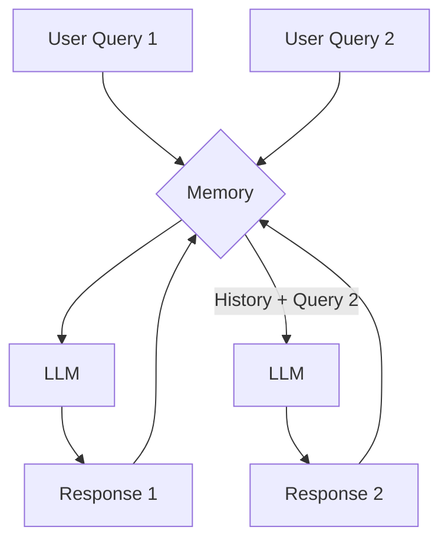

# Memory in Large Language Models

This example demonstrates how to manage conversation memory in applications built with Large Language Models (LLMs).

## Overview

By default, LLMs are stateless on inferences, meaning they do not remember past interactions. Each query sent to an LLM is treated as a completely new and independent request. For a conversational agent to be effective, it needs to remember the context of the ongoing dialogue. This is achieved by implementing a "memory" mechanism.

This example showcases two scenarios:
- **A chatbot with no memory:** Demonstrates the default stateless behavior.
- **A chatbot with basic memory:** Shows how to maintain conversational context.

## Project Structure

```
00_memory/
├── 01_no_memory.py     # Example of a stateless chat application
├── 02_with_memory.py   # Example of a stateful chat application with memory
├── README.md        # This documentation
```

## Part 1: Chatbot Without Memory

In this example, the chatbot processes each query without any knowledge of previous interactions.

### Implementation (`01_no_memory.py`)

The code sets up a simple loop where the user can input messages. The `ChatOllama` model is invoked with only the current user message.

```python
"""
This script demonstrates how memory works in LLMs applications.
"""
from langchain_ollama import ChatOllama

OLLAMA_MODEL_NAME = "llama3.2"  # Ollama model for chat

def main():
    """Main function to demonstrate memory in LLMs."""

    # Get a message from the user
    user_message = input("Enter your query (or press Enter to exit): ")

    while user_message.strip():

        # Generate a response using the chat model
        print("\nGenerating response...")
        chat_model = ChatOllama(model=OLLAMA_MODEL_NAME)
        response = chat_model.invoke(user_message)
        
        print("\nResponse:", response.content)

        # Get the next message from the user
        user_message = input("\nEnter your query (or press Enter to exit): ")


if __name__ == "__main__":
    main()
```

### How it Behaves

If you have a conversation like this:
- **You:** My name is Bob.
- **LLM:** Nice to meet you, Bob!
- **You:** What is my name?
- **LLM:** I'm sorry, I don't know your name.

The LLM has no memory of the first message, so it cannot answer the second question.

## Part 2: Chatbot With Memory

To solve this, we can introduce a simple memory mechanism: storing the conversation history in a list and sending it with each new query.

### Implementation (`02_with_memory.py`)

This version introduces a `chat_memory` list. With each turn, both the user's message and the model's response are appended to this list. The entire history is then sent to the model in the next turn.

```python
"""
This script demonstrates how memory works in LLMs applications.
"""
from langchain_ollama import ChatOllama

OLLAMA_MODEL_NAME = "llama3.2"  # Ollama model for chat

def main():
    """Main function to demonstrate memory in LLMs."""

    chat_memory = []

    # Get a message from the user
    user_message = input("Enter your query (or press Enter to exit): ")

    while user_message.strip():

        # Store the user message in memory
        chat_memory.append(user_message)

        # Generate a response using the chat model
        print("\nGenerating response...")
        chat_model = ChatOllama(model=OLLAMA_MODEL_NAME)
        response = chat_model.invoke(chat_memory)
        
        print("\nResponse:", response.content)

        # Store the response in memory
        chat_memory.append(response.content)

        # Get the next message from the user
        user_message = input("\nEnter your query (or press Enter to exit): ")


if __name__ == "__main__":
    main()
```

### How it Behaves

Now, the conversation would look like this:
- **You:** My name is Bob.
- **LLM:** Nice to meet you, Bob!
- **You:** What is my name?
- **LLM:** Your name is Bob.

The LLM can now answer the question correctly because the previous interaction was included in the context.

## Running the Applications

### Step 1: Start Ollama Service

Ensure Ollama is running:

```bash
ollama serve
```
And you have the `llama3.2` model installed:
```bash
ollama pull llama3.2
```

### Step 2: Execute the Scripts

You can run both scripts to see the difference in behavior.

To run the stateless example:
```bash
cd 00_memory
python 01_no_memory.py
```

To run the stateful example:
```bash
cd 00_memory
python 02_with_memory.py
```

## How It Works: The Memory Flow

### Without Memory

*Each interaction is isolated.*

### With Memory

*The entire conversation history is passed to the LLM on each turn.*

## Key Takeaways

- **Stateless vs. Stateful:** LLMs are inherently stateless. Memory is a feature that must be implemented at the application level.
- **Context is Key:** Providing conversation history as context allows the LLM to maintain a coherent and meaningful dialogue.
- **Memory Management:** While this example uses a simple list, more advanced applications require sophisticated memory management strategies (e.g., summarizing conversations, using windowed memory) to handle long dialogues and avoid exceeding the model's context limit. LangChain provides several advanced memory modules for this purpose.

## Next Steps

1. **Explore LangChain Memory Modules:** Investigate built-in memory types like `ConversationBufferMemory`, `ConversationBufferWindowMemory`, and `ConversationSummaryMemory`.
2. **Integrate with a Chat Interface:** Build a simple web UI using Streamlit or FastAPI to create a more interactive chat experience.
3. **Handle Context Length:** Implement strategies to manage long conversations that might exceed the LLM's maximum context window.
