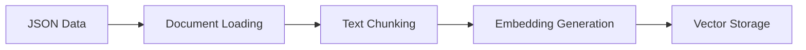
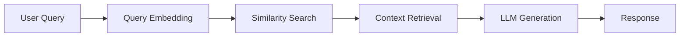

# Local RAG (Retrieval-Augmented Generation) Example

This example demonstrates how to build a complete local RAG system to query information about family members using natural language.

## Overview

RAG (Retrieval-Augmented Generation) combines information retrieval with text generation to provide accurate, context-aware responses. This implementation uses:

- **Ollama** for local LLM inference (both embeddings and chat)
- **LangChain** for orchestrating the RAG pipeline
- **In-memory vector store** for document storage and retrieval
- **Family member data** as the knowledge base

## Project Structure

```
01_local_rag/
├── main.py          # Main RAG implementation
├── context.txt      # Your knowledge base (any text content)
├── README.md        # This documentation
```

## Step-by-Step Implementation Guide

### Step 1: Understanding the Data Structure

The `context.txt` file contains structured family member information:

```json
{
  "family_members": [
    {
      "id": "unique-id",
      "name": "John Doe",
      "birth_date": "1980-01-15",
      "bio": "Sample family member for testing...",
      "relationships": {
        "spouse": "Jane Doe",
        "children": ["Alice Doe", "Bob Doe"]
      },
      "metadata": {
        "occupation": "Software Engineer",
        "location": "San Francisco, CA"
      }
    }
  ]
}
```

### Step 2: Setting Up the Embedding Model

The example uses Ollama's `all-minilm` model for creating vector embeddings:

```python
def get_embedding_model() -> Embeddings:
    return OllamaEmbeddings(model="all-minilm")
```

**What this does:**
- Creates embeddings (vector representations) of text
- Enables semantic similarity search
- Uses a local model (no external API calls)

### Step 3: Configuring the Vector Store

An in-memory vector store is used for storing and retrieving document embeddings:

```python
def get_embedding_store(embeddings: Embeddings) -> VectorStore:
    return InMemoryVectorStore(embeddings)
```

**What this does:**
- Store embedding in memory
- No external database required
- Perfect for prototyping and testing

### Step 4: Setting Up the Chat Model

The example uses Ollama's `gemma3` model for generating responses:

```python
def get_chat_model() -> ChatOllama:
    return ChatOllama(model="gemma3")
```

### Step 5: Document Processing Pipeline

#### Loading Documents
```python
def load_documents(file_path: str):
    loader = TextLoader(file_path)
    return loader.load()
```

#### Splitting into Chunks
```python
def split_documents(documents: list[Document], chunk_size=200, chunk_overlap=20):
    text_splitter = RecursiveCharacterTextSplitter(
        chunk_size=chunk_size, 
        chunk_overlap=chunk_overlap, 
        add_start_index=True
    )
    return text_splitter.split_documents(documents)
```

**Parameters explained:**
- `chunk_size=200`: Maximum characters per chunk
- `chunk_overlap=20`: Overlapping characters between chunks
- `add_start_index=True`: Tracks original position in document

### Step 6: Retrieving relevant chunks from Vector Store
```python
relevant_docs = embedding_store.similarity_search(query, k=3)
```

### Step 7: Add relevant context to Prompt
```python
relevant_docs_content = [doc.page_content for doc in relevant_docs]

PROMPT = f"""
    You are a helpful assistant. 
    
    Use the following context to answer the question: {relevant_docs_content}
    
    Question: {query}
    """

chat_model = get_chat_model()
response = chat_model.invoke(PROMPT)
```

## Running the Application

### Step 1: Start Ollama Service

Ensure Ollama is running:

```bash
ollama serve
```

### Step 2: Execute the RAG System

Run the main script:

```bash
cd 01_local_rag
python main.py
```

### Step 3: Interact with the System

The application will prompt you for queries. Try these examples:

```
Enter your query: Who is John Doe?
Enter your query: What are Alice's hobbies?
Enter your query: Tell me about the family relationships
Enter your query: Who works as a teacher?
```

## How It Works: The RAG Flow

### 1. **Indexing Phase** (Happens once at startup)


### 2. **Query Phase** (Happens for each user query)


### Detailed Flow:

1. **Document Processing:**
   - Load `context.txt` as a text document
   - Split into 200-character chunks with 20-character overlap
   - Generate embeddings for each chunk using `all-minilm`
   - Store embeddings in the in-memory vector store

2. **Query Processing:**
   - User enters a natural language query
   - Query is converted to an embedding vector
   - System searches for the 5 most similar document chunks
   - Retrieved chunks are added to the LLM prompt as context
   - `gemma3` model generates a response based on the context

## Customization Options

### Modify Chunk Size
```python
chunks = split_documents(context_docs, chunk_size=300, chunk_overlap=30)
```

### Change Number of Retrieved Documents
```python
retriever = vector_store.as_retriever(
    search_type="similarity",
    search_kwargs={"k": 10}  # Retrieve top 10 instead of 5
)
```

### Write custom and smarter split document function
For this example, I've written `split_family_documents`, since I know the structure of the document, I can split in smarter way to provide better context to LLM. 

You can simply replace the code as below or write your own:
```python
chunks = split_family_documents(context_docs)
```

### Use Different Models
```python
# Different embedding model
embedding_model = OllamaEmbeddings(model="mxbai-embed-large")

# Different chat model
chat_model = ChatOllama(model="llama3.2")
```

### Add Your Own Data
Replace `context.txt` with your own structured data or use different file formats:

```python
# For text files
loader = TextLoader("your_data.txt")

# For PDF files (requires pypdf)
from langchain_community.document_loaders import PyPDFLoader
loader = PyPDFLoader("your_document.pdf")
```

## Troubleshooting

### Common Issues:

1. **Ollama models not found:**
   ```bash
   ollama pull all-minilm
   ollama pull gemma3
   ```

2. **Ollama service not running:**
   ```bash
   ollama serve
   ```

3. **Memory issues with large documents:**
   - Reduce chunk size
   - Use fewer retrieved documents (lower k value)
   - Consider using a persistent vector store

4. **Slow response times:**
   - Ensure Ollama is using GPU acceleration if available
   - Reduce the number of retrieved documents
   - Use smaller models

## Performance Considerations

- **Memory Usage:** In-memory vector store loads all embeddings into RAM
- **Response Time:** Local models are slower than cloud APIs but provide privacy
- **Accuracy:** Performance depends on the quality and relevance of your data
- **Scalability:** For large datasets, consider using persistent vector stores like Chroma or FAISS

## Next Steps

1. **Add more data sources:** Expand beyond JSON to PDFs, web pages, or databases
2. **Implement persistent storage:** Use Chroma or FAISS for larger datasets
3. **Add conversation memory:** Implement chat history for multi-turn conversations
4. **Create a web interface:** Build a Streamlit or FastAPI frontend
5. **Experiment with different models:** Try various embedding and chat models
6. **Add evaluation metrics:** Implement relevance scoring and response quality metrics

## Security and Privacy

This implementation runs entirely locally:
- No data sent to external services
- All processing happens on your machine
- Complete control over your data and models
- Suitable for sensitive or proprietary information
