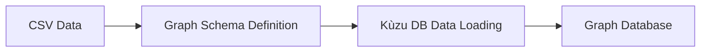
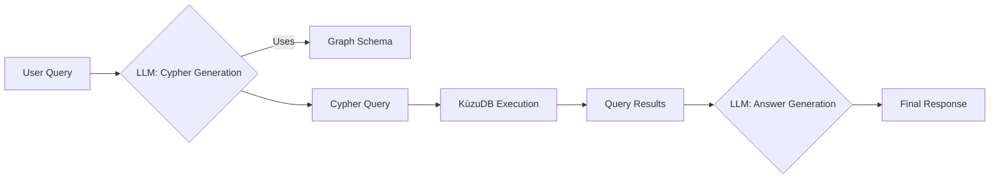

# Local Graph RAG with KùzuDB and Ollama

This example demonstrates how to build a complete local Graph RAG (Retrieval-Augmented Generation) system to query structured information about family members using natural language. Unlike vector-based RAG, this approach leverages a graph database to represent and query complex relationships within the data.

## Overview

Graph RAG combines the power of graph databases with large language models. Instead of searching for similar text chunks, it traverses a knowledge graph to find precise answers, which are then used by an LLM to generate a human-readable response.

This implementation uses:

- **KùzuDB** for creating and querying the local graph database.
- **Ollama** for local LLM inference (`llama3.2` model).
- **LangChain** for orchestrating the LLM interactions.
- **Family member data** in CSV format as the knowledge base.

## Project Structure

```
02_graph_rag/
├── main.py              # Main Graph RAG implementation
├── README.md            # This documentation
├── run_graph_explorer.sh # Script to explore the graph (optional)
├── database/            # Directory for the KùzuDB instance
└── dataset/             # Directory containing the CSV data files
    ├── people.csv
    ├── occupations.csv
    ├── locations.csv
    ├── hobbies.csv
    ├── schools.csv
    ├── has_parents.csv
    ├── has_children.csv
    ├── has_occupations.csv
    ├── has_hobby.csv
    ├── lives_in.csv
    ├── married_to.csv
    └── studies_at.csv
```

## Step-by-Step Implementation Guide

### Step 1: Defining the Graph Schema

The foundation of the system is a graph schema that defines the nodes (entities) and relationships (edges).

```python
GRAPH_SCHEMA = """
    CREATE NODE TABLE Person(name STRING, birth_date DATE, death_date DATE, bio STRING, PRIMARY KEY (name));
    CREATE NODE TABLE Occupation(name STRING, PRIMARY KEY (name));
    CREATE NODE TABLE Location(name STRING, PRIMARY KEY (name));
    CREATE NODE TABLE Hobby(name STRING, PRIMARY KEY (name));
    CREATE NODE TABLE School(name STRING, PRIMARY KEY (name));
    CREATE REL TABLE HAS_PARENT(FROM Person TO Person);
    CREATE REL TABLE HAS_CHILDREN(FROM Person TO Person);
    CREATE REL TABLE HAS_SIBLING(FROM Person TO Person);
    CREATE REL TABLE HAS_OCCUPATION(FROM Person TO Occupation);
    CREATE REL TABLE HAS_HOBBY(FROM Person TO Hobby);
    CREATE REL TABLE IS_MARRIED_TO(FROM Person TO Person);
    CREATE REL TABLE LIVES_IN(FROM Person TO Location);
    CREATE REL TABLE STUDIES_AT(FROM Person TO School);
"""
```

### Step 2: Loading Data from CSV

Data is loaded into the graph database from CSV files using Kùzu's `COPY` command. Each CSV corresponds to a node or relationship table in the schema.

```python
def load_data(conn: kuzu.Connection):
    """Load the data using the COPY command"""
    conn.execute('COPY Person FROM "./dataset/people.csv"')
    conn.execute('COPY Occupation FROM "./dataset/occupations.csv"')
    # ... and so on for all other CSV files
```

### Step 3: Generating a Cypher Query from Natural Language

When a user asks a question, the system first converts it into a Cypher query. The LLM is prompted with the graph schema and the user's question to generate the appropriate query.

```python
cypher_prompt = f"""
    Generate cypher query based on graph database schema to support answer the user question.
    Return the query as a JSON object with the key "cypher".

    <DB_SCHEMA>
    {GRAPH_SCHEMA}
    </DB_SCHEMA>

    <USER_QUESTION>
    {query}
    </USER_QUESTION>
"""
chat_model = get_chat_model()
response = chat_model.invoke(cypher_prompt)
```

### Step 4: Executing the Cypher Query

The generated Cypher query is executed against the Kùzu database to retrieve the relevant information.

```python
json_parser = JsonOutputParser()
json_response = json_parser.parse(text=response.content)
cypher_query = json_response["cypher"]
result = conn.execute(cypher_query)
cypher_results = result.get_all()
```

### Step 5: Generating the Final Response

The results from the graph query are passed back to the LLM as context. The LLM then synthesizes this structured information into a natural language answer for the user.

```python
question_prompt = f"""
    You are a helpful assistant.

    Based on the cypher query and it's result, answer the user's question:
    
    <QUERY_RESULTS>
    {cypher_results}
    </QUERY_RESULTS>

    <USER_QUESTION>
    {query}
    </USER_QUESTION>
"""
chat_model = get_chat_model()
response = chat_model.invoke(question_prompt)
```

## Running the Application

### Step 1: Install Dependencies

Install the required Python packages.
```bash
python -m venv .venv

# macOS or Linux
source ./.venv/bin/activate

# Windows
./.venv/Scripts/Activate.ps1

pip install -r requirements.txt
```

### Step 2: Start Ollama Service

Ensure Ollama is running and has the `llama3.2` model available.
```bash
ollama serve
ollama pull llama3.2
```

### Step 3: Execute the Graph RAG System

Run the main script. On the first run, it will create the database, define the schema, and load the data.
```bash
cd 02_graph_rag
python main.py
```

### Step 4: Interact with the System

The application will prompt you for queries. Try these examples:
```
Enter your query: Who is John Doe's wife?
Enter your query: What does Alice Doe do for a living?
Enter your query: Who are the parents of Bob Doe?
Enter your query: Who lives in San Francisco?
```

## How It Works: The Graph RAG Flow

### 1. **Indexing Phase** (Happens once at startup)


### 2. **Query Phase** (Happens for each user query)


## Customization Options

### Use a Different LLM
You can change the model by updating the `OLLAMA_MODEL_NAME` constant in `main.py`.
```python
OLLAMA_MODEL_NAME = "llama3.2"  # Change to your desired model
```

### Modify the Graph
- **Schema:** Edit the `GRAPH_SCHEMA` string in `main.py` to add new node or relationship types.
- **Data:** Add or modify the CSV files in the `dataset` directory. Remember to delete the `database` directory to force a rebuild after changing the schema or data structure.

## Troubleshooting

- **Ollama service not running:** Ensure the `ollama serve` command is active in a separate terminal.
- **Model not found:** Run `ollama pull llama3.2` (or your chosen model) before executing the script.
- **Database Errors:** If you modify the schema or CSV structure, delete the `./database` directory to allow the script to rebuild it from scratch.

## Security and Privacy

This implementation runs entirely locally:
- No data is sent to external services.
- All processing happens on your machine.
- You have complete control over your data and models.
- It is suitable for sensitive or proprietary information.
