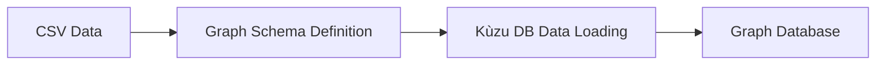
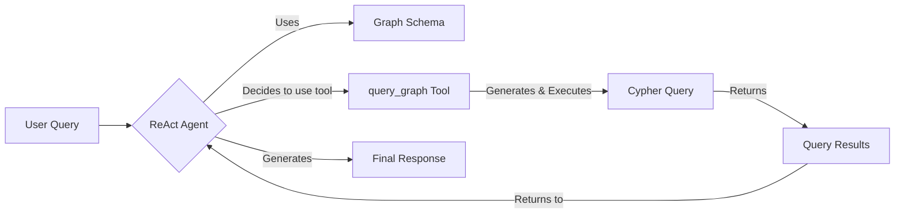

# Local Graph RAG with Tool Calling

This example demonstrates how to build a local Graph RAG (Retrieval-Augmented Generation) system that uses a tool-calling agent to query structured information about family members using natural language. This approach leverages a ReAct agent from LangGraph to dynamically decide when to query the graph database.

## Overview

This implementation uses a tool-calling agent to interact with a graph database. Instead of a multi-step chain that first generates a Cypher query and then passes it to a second chain for a final answer, this approach empowers an agent to decide when and how to use a `query_graph` tool.

This implementation uses:

- **KùzuDB** for creating and querying the local graph database.
- **Ollama** for local LLM inference (`llama3.2` model).
- **LangChain & LangGraph** for creating a tool-calling agent (`create_react_agent`).
- **Family member data** in CSV format as the knowledge base.

## Project Structure

```
03_tools_calling/
├── main.py              # Main Graph RAG implementation with a tool-calling agent
├── README.md            # This documentation
├── run_graph_explorer.sh # Script to explore the graph (optional)
├── database/            # Directory for the KùzuDB instance
└── dataset/             # Directory containing the CSV data files
    ├── people.csv
    ├── occupations.csv
    # ... and other data files
```

## Step-by-Step Implementation Guide

### Step 1: Defining the Graph Schema

The foundation of the system is a graph schema that defines the nodes (entities) and relationships (edges).

```python
GRAPH_SCHEMA = """
    CREATE NODE TABLE Person(name STRING, birth_date DATE, death_date DATE, bio STRING, PRIMARY KEY (name));
    CREATE NODE TABLE Occupation(name STRING, PRIMARY KEY (name));
    CREATE NODE TABLE Location(name STRING, PRIMARY KEY (name));
    CREATE NODE TABLE Hobby(name STRING, PRIMARY KEY (name));
    CREATE NODE TABLE School(name STRING, PRIMARY KEY (name));
    CREATE REL TABLE HAS_PARENT(FROM Person TO Person);
    CREATE REL TABLE HAS_CHILDREN(FROM Person TO Person);
    CREATE REL TABLE HAS_SIBLING(FROM Person TO Person);
    CREATE REL TABLE HAS_OCCUPATION(FROM Person TO Occupation);
    CREATE REL TABLE HAS_HOBBY(FROM Person TO Hobby);
    CREATE REL TABLE IS_MARRIED_TO(FROM Person TO Person);
    CREATE REL TABLE LIVES_IN(FROM Person TO Location);
    CREATE REL TABLE STUDIES_AT(FROM Person TO School);
"""
```

### Step 2: Loading Data from CSV

Data is loaded into the graph database from CSV files using Kùzu's `COPY` command.

```python
GRAPH_DATA_LOAD = """
    COPY Person FROM "./dataset/people.csv";
    COPY Occupation FROM "./dataset/occupations.csv";
    COPY Location FROM "./dataset/locations.csv";
    COPY Hobby FROM "./dataset/hobbies.csv";
    COPY School FROM "./dataset/schools.csv";
    COPY HAS_PARENT FROM "./dataset/has_parents.csv";
    COPY HAS_CHILDREN FROM "./dataset/has_children.csv";
    COPY HAS_SIBLING FROM "./dataset/has_siblings.csv";
    COPY HAS_OCCUPATION FROM "./dataset/has_occupations.csv";
    COPY HAS_HOBBY FROM "./dataset/has_hobby.csv";
    COPY LIVES_IN FROM "./dataset/lives_in.csv";
    COPY IS_MARRIED_TO FROM "./dataset/married_to.csv";
    COPY STUDIES_AT FROM "./dataset/studies_at.csv";
"""
```

### Step 3: Creating a Graph Query Tool

A function to execute Cypher queries is defined and exposed as a tool using the `@tool` decorator. The agent will be able to call this function when it determines that it needs to query the database to answer a user's question.

```python
@tool
def query_graph(cypher_query: str) -> list:
    """Execute a Cypher query on the graph database and return the results."""
    print("\nExecuting Cypher query...")
    print(cypher_query)

    cypher_query_result = conn.execute(cypher_query)
    results = cypher_query_result.get_all()

    print("\nQuery Results:")
    for row in results:
        print(row)
        print(10 * "-")

    return results
```

### Step 4: Creating and Running the ReAct Agent

A ReAct agent is created using LangGraph's `create_react_agent`. This agent is provided with the LLM and the list of available tools (in this case, just `query_graph`). The agent is then invoked with a system message containing the graph schema and the user's query.

```python
chat_model = ChatOllama(model=OLLAMA_MODEL_NAME)
agent = create_react_agent(chat_model, [query_graph])

messages = [
    {"role": "system", "content": SYSTEM_MESSAGE},
    {"role": "user", "content": user_message}
]

for step in agent.stream({"messages": messages}, stream_mode="values"):
    step["messages"][-1].pretty_print()
```

## Running the Application

### Step 1: Install Dependencies

Install the required Python packages.
```bash
python -m venv .venv

# macOS or Linux
source ./.venv/bin/activate

# Windows
./.venv/Scripts/Activate.ps1

pip install -r requirements.txt
```

### Step 2: Start Ollama Service

Ensure Ollama is running and has the `llama3.2` model available.
```bash
ollama serve
ollama pull llama3.2
```

### Step 3: Execute the Graph RAG System

Run the main script. On the first run, it will create the database, define the schema, and load the data.
```bash
cd 03_tools_calling
python main.py
```

### Step 4: Interact with the System

The application will prompt you for queries. Try these examples:
```
Enter your query: Who is John Doe's wife?
Enter your query: What does Alice Doe do for a living?
Enter your query: Who are the parents of Bob Doe?
Enter your query: Who lives in San Francisco?
```

## How It Works: The Tool-Calling Flow

### 1. **Indexing Phase** (Happens once at startup)


### 2. **Query Phase** (Happens for each user query)


## Customization Options

### Use a Different LLM
You can change the model by updating the `OLLAMA_MODEL_NAME` constant in `main.py`.
```python
OLLAMA_MODEL_NAME = "llama3.2"  # Change to your desired model
```

### Modify the Graph
- **Schema:** Edit the `GRAPH_SCHEMA` string in `main.py` to add new node or relationship types.
- **Data:** Add or modify the CSV files in the `dataset` directory. Remember to delete the `database` directory to force a rebuild after changing the schema or data structure.

## Troubleshooting

- **Ollama service not running:** Ensure the `ollama serve` command is active in a separate terminal.
- **Model not found:** Run `ollama pull llama3.2` (or your chosen model) before executing the script.
- **Database Errors:** If you modify the schema or CSV structure, delete the `./database` directory to allow the script to rebuild it from scratch.

## Security and Privacy

This implementation runs entirely locally:
- No data is sent to external services.
- All processing happens on your machine.
- You have complete control over your data and models.
- It is suitable for sensitive or proprietary information.
